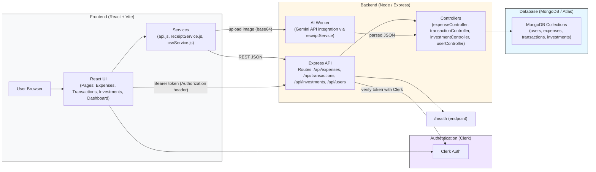

# MyPocket — Final Flowchart

This is the canonical Mermaid flowchart for the **MyPocket** project.
It shows the core runtime flows: **Frontend → Auth → Backend → AI → Database.**

```mermaid
flowchart LR
  %% === Frontend ===
  subgraph Frontend ["Frontend (React + Vite)"]
    U[User Browser]
    UI["React UI\n(Pages: Expenses, Transactions, Investments, Dashboard)"]
    SVC["Services\n(api.js, receiptService.js, csvService.js)"]
  end

  %% === Authentication ===
  subgraph Auth ["Authentication (Clerk)"]
    CL[Clerk Auth]
  end

  %% === Backend ===
  subgraph Backend ["Backend (Node / Express)"]
    API["Express API\nRoutes: /api/expenses, /api/transactions, /api/investments, /api/users"]
    CTRL["Controllers\n(expenseController, transactionController, investmentController, userController)"]
    AI["AI Worker\n(Gemini API integration via receiptService)"]
  end

  %% === Database ===
  subgraph Database ["Database (MongoDB / Atlas)"]
    DB["MongoDB Collections\n(users, expenses, transactions, investments)"]
  end

  %% === Connections ===
  U --> UI
  UI --> SVC
  SVC -->|REST JSON| API
  API --> CTRL
  CTRL --> DB
  SVC -->|"upload image (base64)"| AI
  AI -->|parsed JSON| CTRL
  UI --> CL
  UI -->|"Bearer token (Authorization header)"| API
  API -->|"verify token with Clerk"| CL
  API --> ServerHealth["/health (endpoint)"]

  %% === Styles ===
  style Frontend fill:#f8f9fa,stroke:#333,stroke-width:1px
  style Backend fill:#fff7e6,stroke:#333,stroke-width:1px
  style Database fill:#e6f7ff,stroke:#333,stroke-width:1px
  style Auth fill:#f0e6ff,stroke:#333,stroke-width:1px
```
